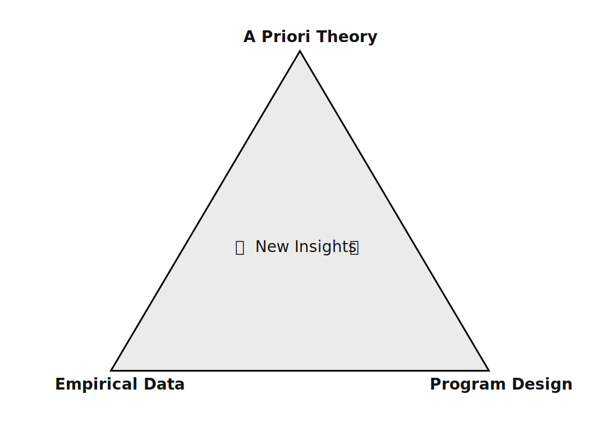

# RegenLearnings.xyz

RegenLearnings is a group of people who want to learn in public, share ideas, and apply research related to public goods funding. Our interests and experience lie in *a priori* theory, analysis of empirical data, and program design. We believe it is at the intersection of these things that the magic happens.

## Getting Started

- Read the intro blog post: https://gov.gitcoin.co/t/regenlearnings-xyz-research-group/17361
- Join the telegram: https://t.me/+QE6Pm1DtfktkYjYx

## Process

1. Keep it simple.
2. Best practice: Publish a blog post when you have something worthwhile to share.  This group can help you prioritize, shape ideas + review drafts to get there.
3. We coordinate asyncronously in telegram.
4. There will be a monthly call to pitch ideas.
5. If you and your collaborators need more coordination, you can coordinate that!

## Resources

1. Tracker of curated [Learnings](learnings.mdx)
2. Notes and agenda for our [Monthly Calls](calls.mdx)
3. Some of us have started working on a [Regen Data Bootcamp](data-bootcamp.mdx). 

## WIP Backlog

(this list curated by Carl/Kevin, but more emergent backlog will be forthcoming)

1. Further delving into [these](https://cerv.one/essays/levels_of_the_game.html)
   1. There are at least four components to designing a voting strategy:
      1. Impact Vector: Identifying the type of impact you want to amplify over time.
      2. Distribution Curve: Determining how flat or skewed the eventual distribution of tokens to projects should be.
      3. Eligibility Criteria: Establishing parameters to determine which projects qualify.
      4. Award Function: Creating a formula or rubric to equate impact with profit.
2. Impact Attestations
   1. Data Analysis on Impact Attestations
   2. Long tail Impact Attestestations
   3. How can A web of trust be built around impact attestations?
3. Getting degens to the regen party.
   1. How could we get degens to emergently contribute to regen things?
   2. Perhaps we could invite them to speculate on RPGF?
4. Novel directions in the [shape rotators guide to funding what matters](https://gov.gitcoin.co/t/shape-rotators-guide-to-funding-what-matters/17174).
5. Simulation Models you can tune + run out of the box.
6. Building things on top of well curated data models like [regendata.xyz](https://gov.gitcoin.co/t/regendata-xyz-our-sybil-resistant-future-q3-2023-and-beyond/16474), [Gitcoin-Grants-Data-Portal](https://github.com/davidgasquez/gitcoin-grants-data-portal) or OSObserver.
7. Using Data Visualization and taking a page from the [#dataisbeautiful playbook](https://www.reddit.com/r/dataisbeautiful/) to create new ways of exploring and surfacing insights from impact data

Meta stuff (not object level, but about regenlearnings.xyz itself)

1. Making all of the learnings indexed and queryable via an LLM.
2. how does a new researcher "sync to HEAD" of all of the latest context for important subject matter (OP RPGF program design, gitcoin grants program design, data supporting each)
3. how do we want to maintain this resource?
